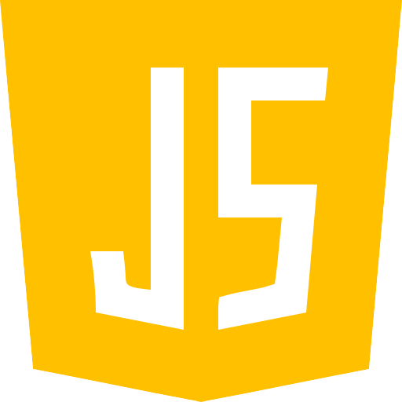
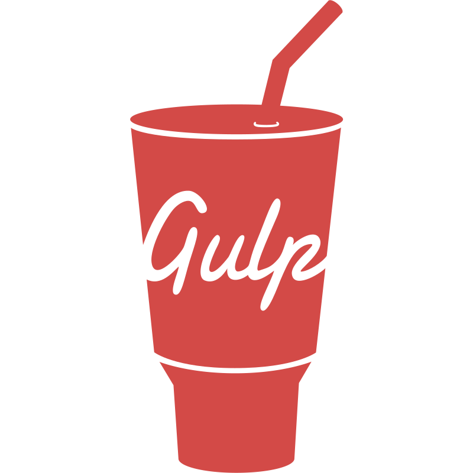

<h3>Hi 👋 My name is Boris</h3>

<!--
**borisweb2020/borisweb2020** is a ✨ _special_ ✨ repository because its `README.md` (this file) appears on your GitHub profile.
-->

I am a beginner programmer and web developer.

I have experience in non-commercial website development.

<ul>
  <li>🔭 I’m currently studying programming languages such as C and Java</li>
  <li>🤝 I enjoy working in a team and am excited to learn from experienced developers</li>
</ul>
<h3>Skills</h3>

<h3>Socials</h3>
